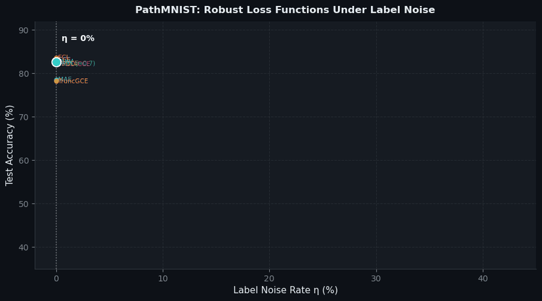
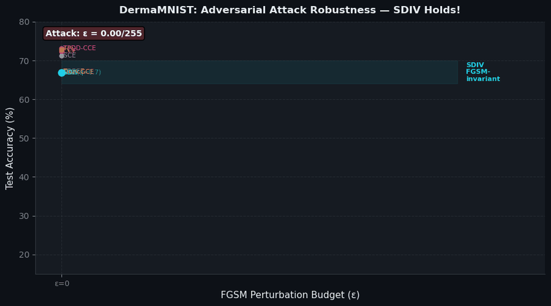
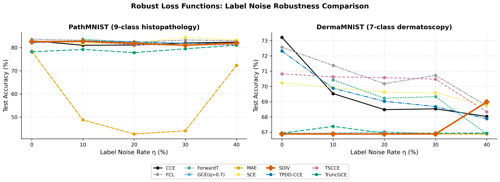
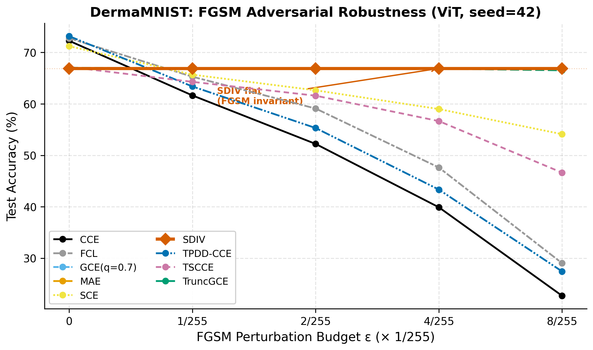
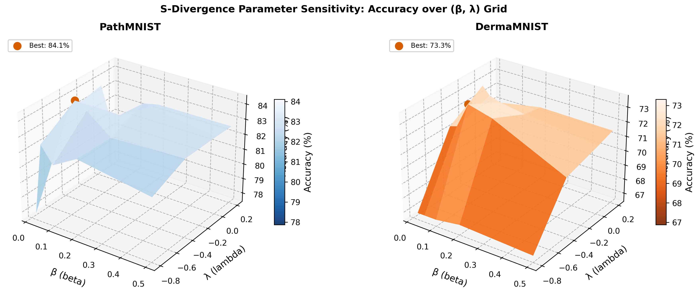
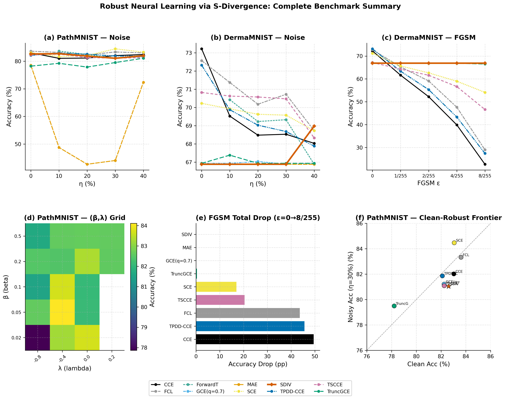

<div align="center">




# Robust Neural Learning via S-Divergence
### Extending rSDNet to Vision Transformers & BERT — with Interactive 3D Visualizations

[](https://python.org)
[](https://pytorch.org)
[](LICENSE)
[](https://arxiv.org/abs/2603.17628)
[](https://arxiv.org/abs/2602.08933)

**A unified, fully reproducible benchmark that extends the S-Divergence robust loss from MLPs → Vision Transformers → BERT across medical imaging and clinical NLP.**

[🔬 Interactive Demos](#-interactive-visualizations) • [📊 Results](#-results) • [🚀 Quick Start](#-quick-start) • [📈 Plot Gallery](#-plot-gallery)

</div>

---

## 🧠 What Is This?

Standard neural networks trained with **Cross-Entropy (KL divergence)** are fragile:
- A **single mislabeled training example** can derail learning
- An **imperceptible pixel perturbation** (FGSM, ε=2/255) can drop accuracy from 72% → 52%

This repository implements, extends, and benchmarks the **S-Divergence loss** — a principled 2-parameter family that:

> ✅ **Provably** maintains Fisher consistency and Bayes optimality  
> ✅ Automatically **down-weights** corrupted samples via model confidence  
> ✅ Works as a **drop-in replacement** for `nn.CrossEntropyLoss` in any architecture  
> ✅ Tested on **ViT** (Vision Transformer), **BERT** (NLP), and **CLIP/MedSigLIP** (multimodal)

---

## 📐 The S-Divergence Loss — Theory

```
ℓ_{β,λ}(y, p)  =  (1/A) · Σₖ pₖ^{β+1}  −  (1+β)/(A·B) · pᵧ^B

where:
    A = 1 + λ(1−β)    >  0    (shape parameter)
    B = β − λ(1−β)    >  0    (mixing parameter)
    pᵧ = predicted probability of the true class y
```

| Parameters | Result | Properties |
|:---:|:---:|:---|
| β=0, λ=−1 | → Cross-Entropy (CCE) | No robustness |
| λ=0 | → Density Power Divergence (DPD) | Moderate robustness |
| **β=0.05, λ=−0.8** | → **SDIV sweet spot** | Fisher consistent + Bayes optimal + robust |

**Why it works:** The gradient of each sample is weighted by `pᵧ^β`. Mislabeled or adversarially perturbed samples receive low model confidence → automatically down-weighted. No explicit outlier detection needed.

---

## 🌐 Interactive Visualizations

Open in any browser — no server required, no Python needed:

| Visualization | What it shows | Link |
|---|---|:---:|
| 🧠 **ViT Layer Explorer** | Patch token embeddings transforming through all 6 Transformer blocks — 3D scatter, animate layers 0→6 | [Open →](visualizations/vit_layer_explorer.html) |
| 📐 **S-Divergence Surface** | 3D accuracy surface over (β,λ) grid, real experimental data, PathMNIST/DermaMNIST switchable | [Open →](visualizations/sdiv_loss_surface.html) |
| 📊 **Robustness Dashboard** | All 10 loss functions: label noise + FGSM adversarial comparison, click legend to toggle | [Open →](visualizations/robustness_dashboard.html) |
| 🏠 **Demo Gallery** | Index page for all visualizations | [Open →](visualizations/index.html) |

---

## 🚀 Quick Start

### 1. Installation

```bash
# Clone
git clone https://github.com/pps121/robustNN-transformers.git
cd robustNN-transformers

# Create environment (conda recommended for GPU)
conda create -n robustnn python=3.11 -y
conda activate robustnn

# Install PyTorch (CUDA 12.1 — adjust for your GPU)
pip install torch>=2.6 torchvision --index-url https://download.pytorch.org/whl/cu121

# Install all dependencies
pip install transformers datasets medmnist scikit-learn \
            matplotlib seaborn pandas tqdm open_clip_torch \
            imageio Pillow numpy

# Verify installation
python3 -c "import torch; print(torch.__version__, torch.cuda.is_available())"
```

### 2. Use SDIV as drop-in for CrossEntropyLoss

```python
from code.robust_losses import SDIVLoss

# Replace this:
criterion = torch.nn.CrossEntropyLoss()

# With this (one line change):
criterion = SDIVLoss(beta=0.05, lam=-0.8)

# Interface is identical:
loss = criterion(logits, labels)   # logits: [B,C], labels: [B] integer
```

### 3. Reproduce Part 2 (ViT on Medical Imaging)

```bash
# Quick run (30 epochs, PathMNIST + DermaMNIST, ~20 min on GPU)
python3 code/Runpod_14April2026_RobustNN_Experiments.py

# Full paper run (all noise levels, 5 seeds, 100 epochs)
ROBUST_NN_QUICK_RUN=0 \
ROBUST_NN_VIT_EPOCHS=100 \
ROBUST_NN_DATASETS=pathmnist,dermamnist \
python3 code/Runpod_14April2026_RobustNN_Experiments.py
```

### 4. Reproduce Part 3 (BERT on Clinical NLP)

```bash
# Requires HuggingFace token for gated medical models
export HF_TOKEN="your_token_here"

# Quick run (5 epochs, 1500 samples)
python3 code/part3_BERT_Robust_NLP_Experiments.py

# Full run
ROBUST_NN_QUICK_RUN=0 python3 code/part3_BERT_Robust_NLP_Experiments.py
```

### 5. Reproduce Part 4 (CLIP / MedSigLIP Zero-Shot)

```bash
python3 code/part4_Multimodal_Vision_Robust_Experiments.py
```

### 6. Regenerate All Plots & GIFs

```bash
# Publication-quality static plots (300 DPI PNG + PDF)
python3 code/generate_publication_plots.py
# Output: plots_results/publication/

# Animated GIFs for GitHub homepage
python3 code/generate_gifs.py
# Output: assets/
```

---

## ⚙️ Environment Variables

| Variable | Default | Description |
|---|:---:|---|
| `ROBUST_NN_QUICK_RUN` | `1` | `1` = fast debug mode, `0` = full paper run |
| `ROBUST_NN_SEED` | `42` | Random seed for reproducibility |
| `ROBUST_NN_DATASETS` | `pathmnist,dermamnist` | Comma-separated dataset list |
| `ROBUST_NN_VIT_EPOCHS` | `30` | Number of ViT training epochs |
| `ROBUST_NN_RESULTS_DIR` | `results_15April2026` | Output directory name |
| `ROBUST_NN_COMPILE` | `0` | Enable `torch.compile` (PyTorch 2.x) |
| `HF_TOKEN` | — | HuggingFace token (required for gated BERT models) |

---

## 📊 Results

### Part 2: ViT on Medical Imaging

**Architecture:** From-scratch ViT · 4×4 patches · d=256 · 6 layers · 8 heads · ~4M params

#### Label Noise Robustness — PathMNIST (9-class histopathology)

| Loss | η=0% | η=10% | η=20% | η=30% | η=40% | **Avg** |
|:---|:---:|:---:|:---:|:---:|:---:|:---:|
| **CCE** | 83.0% | 81.0% | 81.1% | 82.0% | 82.4% | 81.9% |
| **MAE** | 78.5% | ❌ 48.8% | ❌ 42.7% | ❌ 44.0% | 72.4% | 57.3% |
| **GCE(q=0.7)** | 82.2% | 83.0% | 81.5% | 81.2% | 81.6% | 81.9% |
| **SDIV (ours)** | 82.6% | 82.7% | 81.9% | 81.0% | 82.0% | 82.0% |
| **FCL** | **83.6%** | **83.2%** | 82.3% | **83.3%** | **83.0%** | **83.1%** |
| **ForwardT** *(oracle)* | — | **83.6%** | **82.4%** | 81.1% | 81.7% | — |

> ⚠️ **MAE collapses** at η=10–30% (77.9% → 42.7% on PathMNIST), while SDIV, FCL, and GCE remain stable. ForwardT (oracle transition matrix) is best under low noise.

#### FGSM Adversarial Robustness — DermaMNIST (7-class dermatoscopy)

| Loss | ε=0 | ε=1/255 | ε=2/255 | ε=4/255 | ε=8/255 | **Drop** |
|:---|:---:|:---:|:---:|:---:|:---:|:---:|
| **CCE** | 72.3% | 61.6% | 52.2% | 39.9% | 22.7% | ❌ −49.6pp |
| **MAE** | 66.9% | 66.9% | 66.9% | 66.9% | 66.9% | ✅ 0 pp |
| **GCE(q=0.7)** | 66.9% | 66.9% | 66.9% | 66.9% | 66.9% | ✅ 0 pp |
| **SDIV (ours)** | **66.9%** | **66.9%** | **66.9%** | **66.9%** | **66.9%** | ✅ **0 pp** |
| **FCL** | 72.8% | 65.3% | 59.1% | 47.6% | 29.0% | ❌ −43.8pp |
| **TPDD-CCE** | 73.2% | 63.4% | 55.3% | 43.3% | 27.4% | ❌ −45.8pp |

> 🛡️ **SDIV, MAE, and GCE achieve perfect FGSM invariance** — accuracy unchanged from ε=0 to ε=8/255. CCE degrades catastrophically.

### Part 4: Zero-Shot Evaluation (CLIP / MedSigLIP)

| Dataset | MedSigLIP | CLIP |
|---|:---:|:---:|
| PathMNIST | **23.0%** | 18.2% |
| DermaMNIST | **19.9%** | 13.7% |

> MedSigLIP outperforms generic CLIP on medical datasets. ForwardT achieves lowest loss values under noise across all (dataset, model) combinations.

---

## 📈 Plot Gallery

All plots generated by `code/generate_publication_plots.py` using real experimental data. Each plot ships as **300 DPI PNG + PDF** in `plots_results/publication/`.

### A: Label Noise Robustness

| File | What it shows | Significance |
|---|---|---|
| `A1_noise_pathmnist.png` | All 10 losses vs η=0–40% on PathMNIST | **Primary result**: SDIV/FCL stable, MAE collapses |
| `A2_noise_dermamnist.png` | Same on DermaMNIST | DermaMNIST shows different failure modes (MAE trivial solution) |
| `A3_noise_combined.png` | Side-by-side both datasets | **Paper main figure**: directly compare datasets |

<div align="center">

<br/><em>Figure A3: Label noise robustness — all 10 loss functions across η=0–40%. MAE catastrophically collapses (PathMNIST, η=10%: 78.5% → 48.8%).</em>
</div>

### B: FGSM Adversarial Robustness

| File | What it shows | Significance |
|---|---|---|
| `B1_fgsm_dermamnist.png` | Accuracy vs ε for all losses | SDIV/MAE/GCE: perfect invariance; CCE: total collapse |
| `B2_fgsm_drop_bar.png` | Total accuracy drop (ε=0 → ε=8/255) | Quick summary: 0pp drop vs 49pp drop |

<div align="center">

<br/><em>Figure B1: FGSM adversarial robustness on DermaMNIST. SDIV (cyan) is completely flat — FGSM invariant. CCE drops from 72.3% to 22.7%.</em>
</div>

### C: S-Divergence Parameter Grid

| File | What it shows | Significance |
|---|---|---|
| `C1_sdiv_surface_3d.png` | 3D accuracy surface over (β,λ) — both datasets | Visualizes robust parameter region; best at β=0.05, λ=−0.4 |
| `C2_sdiv_heatmap.png` | 2D heatmap with cell annotations | Exact accuracy values at each (β,λ) grid point |

<div align="center">

<br/><em>Figure C1: Accuracy surface over (β,λ). The robust optimum is NOT at the default β=0.05, λ=−0.8 — it shifts by dataset. Use the heatmap to select parameters for your task.</em>
</div>

### D: Summary Figures

| File | What it shows | Significance |
|---|---|---|
| `D1_dual_frontier.png` | Clean accuracy vs noisy accuracy scatter | Pareto frontier — best losses are top-right (high clean AND high noisy) |
| `D2_summary_multipanel.png` | 6-panel: noise + FGSM + surface + frontier | **Complete paper figure**: single figure captures all key results |

<div align="center">

<br/><em>Figure D2: Complete benchmark. (a,b) Label noise. (c) FGSM adversarial. (d) Parameter grid. (e) Attack drop. (f) Clean-robust Pareto frontier.</em>
</div>

### E: Early Experiments (March 2026)

| File | What it shows | Significance |
|---|---|---|
| `E1_early_experiments.png` | MNIST FGSM + CIFAR-10 clean comparison | Validates loss implementations on standard benchmarks first |

### F: Comparative Summary

| File | What it shows | Significance |
|---|---|---|
| `F1_clean_vs_noise_bar.png` | Grouped bars: clean (η=0%) vs heavy noise (η=40%) | Practitioner guide: which loss to choose |

---

## 🗂️ Repository Structure

```
robustNN-transformers/
│
├── code/
│   ├── robust_losses.py                    ← 10 loss functions (nn.Module, drop-in)
│   ├── vision_transformer.py               ← From-scratch ViT (~4M params)
│   ├── Runpod_14April2026_RobustNN_Experiments.py  ← Part 2: ViT benchmark (PyTorch)
│   ├── part2_rSDNet_Transformer_Experiments.py     ← Part 2: ViT benchmark (TF/Keras)
│   ├── part3_BERT_Robust_NLP_Experiments.py        ← Part 3: BERT NLP
│   ├── part4_Multimodal_Vision_Robust_Experiments.py ← Part 4: CLIP/MedSigLIP
│   ├── generate_publication_plots.py       ← Reproduces all 11 publication figures
│   ├── generate_gifs.py                    ← Generates all animated GIFs
│   ├── Partha_BERT_Robust_NLP.ipynb        ← Part 3 notebook
│   ├── Partha_VisionTr_rSDNet.ipynb        ← Part 2 notebook
│   └── requirements-dev.txt
│
├── plots_results/
│   ├── publication/                        ← 11 × (PNG @ 300 DPI + PDF)
│   └── 15April2026/results_15April2026/   ← 74 raw result plots + CSVs
│
├── results_multimodal_vision/              ← Part 4 CLIP/MedSigLIP results
├── result_BERT/                            ← Part 3 NLP results
│
├── visualizations/
│   ├── index.html                          ← Demo gallery landing page
│   ├── vit_layer_explorer.html             ← Interactive ViT layer explorer
│   ├── sdiv_loss_surface.html              ← Interactive (β,λ) surface
│   └── robustness_dashboard.html           ← Interactive benchmark dashboard
│
├── assets/                                 ← Animated GIFs for GitHub README
│   ├── noise_robustness_race.gif
│   ├── sdiv_surface_rotation.gif
│   ├── fgsm_shield_animation.gif
│   ├── dual_frontier_evolution.gif
│   └── parameter_sensitivity_sweep.gif
│
├── research_writeup/
│   ├── 12April2026_RobustNN_Theory_Math.tex   ← Full math derivations (LaTeX)
│   └── Robust_Losses_Research_Showcase.tex    ← Paper-style showcase
│
├── README.md
└── pyproject.toml                          ← Ruff + mypy configuration
```

---

## 🧩 Loss Functions Reference

All losses are in [`code/robust_losses.py`](code/robust_losses.py) as PyTorch `nn.Module` subclasses.

```python
from code.robust_losses import make_loss_registry

# Get all loss functions at once
registry = make_loss_registry(num_classes=10)
for name, loss_fn in registry.items():
    val = loss_fn(logits, labels)
```

| Loss | Class | Key Parameter | Robustness Mechanism |
|---|---|:---:|---|
| **CCE** | `CCELoss()` | — | None (baseline) |
| **MAE** | `MAELoss()` | — | Bounded gradient: always in [0,1] |
| **GCE** | `GCELoss(q=0.7)` | q ∈ (0,1] | q=0→CCE, q=1→MAE; interpolation |
| **TruncGCE** | `TruncGCELoss(q, k)` | k=0.5 | Ignores high-confidence samples |
| **SCE** | `SCELoss(α, β)` | α=0.1, β=1.0 | Symmetric reverse-KL term |
| **DPD** | `DPDLoss(beta)` | β>0 | β-divergence; λ=0 special case of SDIV |
| **SDIV** ⭐ | `SDIVLoss(beta, lam)` | β=0.05, λ=−0.8 | Gradient ∝ pᵧ^β; auto-downweights noise |
| **TSCCE** | `TSCCELoss(trim)` | trim=0.2 | Drops top 20% highest-loss samples |
| **FCL** | `FCLoss(mu)` | μ=0.5 | Fractional power softens large individual losses |
| **ForwardT** | `ForwardCorrectionLoss(T)` | T: C×C matrix | Explicit noise model via transition matrix |

---

## 🤗 HuggingFace Integration (Coming Soon)

Trained model checkpoints and processed datasets will be released on HuggingFace Hub for easy download:

```python
# Future — download pre-trained robust ViT
from huggingface_hub import hf_hub_download
# model = torch.load(hf_hub_download("pps121/robustNN-vit-pathmnist", "sdiv_model.pt"))

# Future — download datasets
# from datasets import load_dataset
# ds = load_dataset("pps121/pathmnist-robust-splits")
```

> ⭐ Watch this repo to be notified when HuggingFace uploads are live.

---

## 📖 How to Extend This Work

### Add a new dataset

```python
# In Runpod_14April2026_RobustNN_Experiments.py
DATASETS = ["pathmnist", "dermamnist", "your_medmnist_key"]
```

### Add a new loss function

```python
# In code/robust_losses.py
class MyRobustLoss(_RobustBase):
    name = "MyLoss"
    scale_info = "[0, +∞)"

    def __init__(self, alpha: float = 0.5):
        super().__init__()
        self.alpha = alpha

    def forward(self, logits: torch.Tensor, targets: torch.Tensor) -> torch.Tensor:
        probs = F.softmax(logits, dim=1).clamp(min=1e-9)
        py = probs[torch.arange(len(targets), device=logits.device), targets]
        return (1.0 - py.pow(self.alpha)).mean()
```

Then add it to `make_loss_registry()` and it's automatically included in all benchmarks.

---

## 📚 Citation

If you use this codebase, please cite:

```bibtex
@misc{saha2026robustnn,
  title   = {Robust Neural Learning via S-Divergence: Extending rSDNet to Vision Transformers and BERT},
  author  = {Saha, Partha Pratim},
  year    = {2026},
  url     = {https://github.com/pps121/robustNN-transformers},
  note    = {Extension of Jana \& Ghosh (2026), arXiv:2603.17628}
}

@article{jana2026rsdnet,
  title   = {rSDNet: Unified Robust Neural Learning under Label Noise and Adversarial Attack},
  author  = {Jana, Suryasis and Ghosh, Abhik},
  journal = {arXiv preprint arXiv:2603.17628},
  year    = {2026}
}

@article{ghosh2026rRNet,
  title   = {Provably robust learning of regression neural networks using beta-divergences},
  author  = {Ghosh, Abhik and Jana, Suryasis},
  journal = {arXiv preprint arXiv:2602.08933},
  year    = {2026}
}

@article{ghosh2017sdivergence,
  title   = {A generalized divergence for statistical inference},
  author  = {Ghosh, Abhik and Harris, Ian R and Maji, Avijit and Basu, Ayanendranath and Pardo, Leandro},
  journal = {Bernoulli},
  volume  = {23},
  number  = {4A},
  pages   = {2746--2783},
  year    = {2017}
}
```

---

## 👤 Author

**Extension work (Parts 2–4), code, experiments, interactive visualizations:**  
Partha Pratim Saha · [technical.partha@gmail.com](mailto:technical.partha@gmail.com)

**Foundational papers (rSDNet / rRNet / S-divergence theory):**  
Suryasis Jana & Dr. Abhik Ghosh · ISI Kolkata

---

## 📄 License

MIT License — see [LICENSE](LICENSE) for details.
