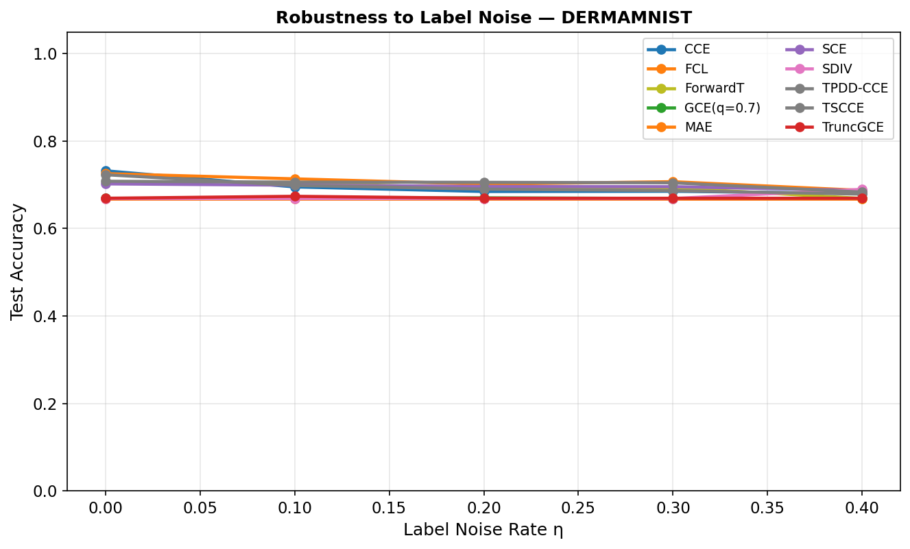
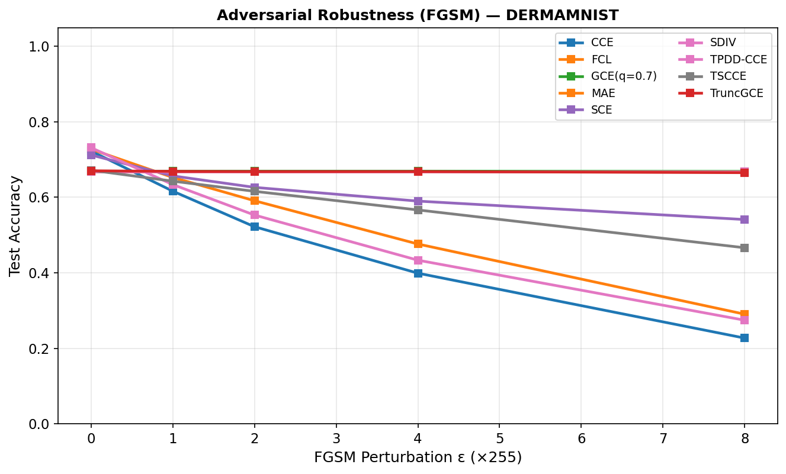
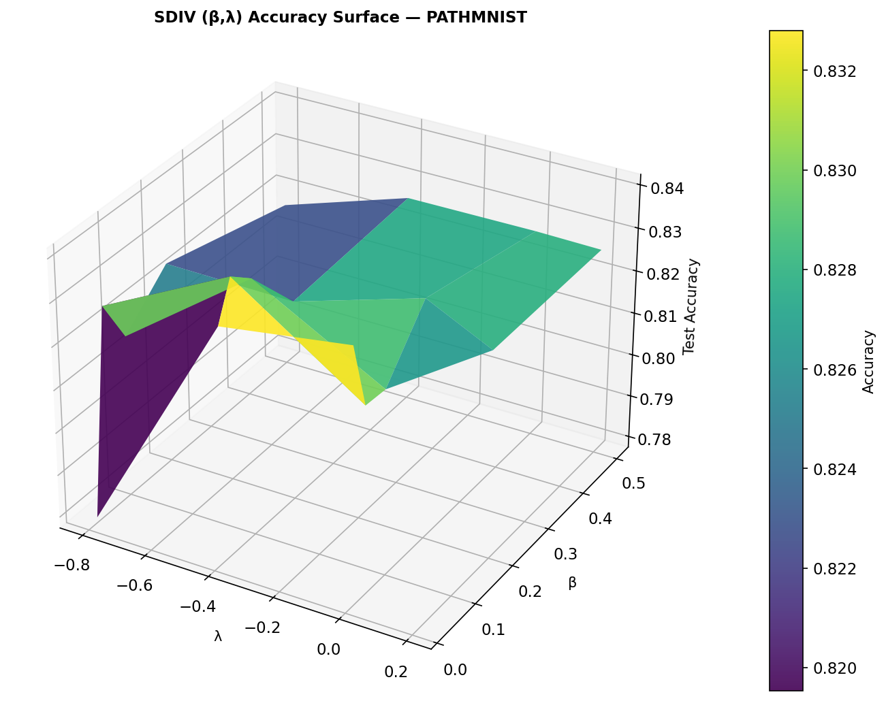
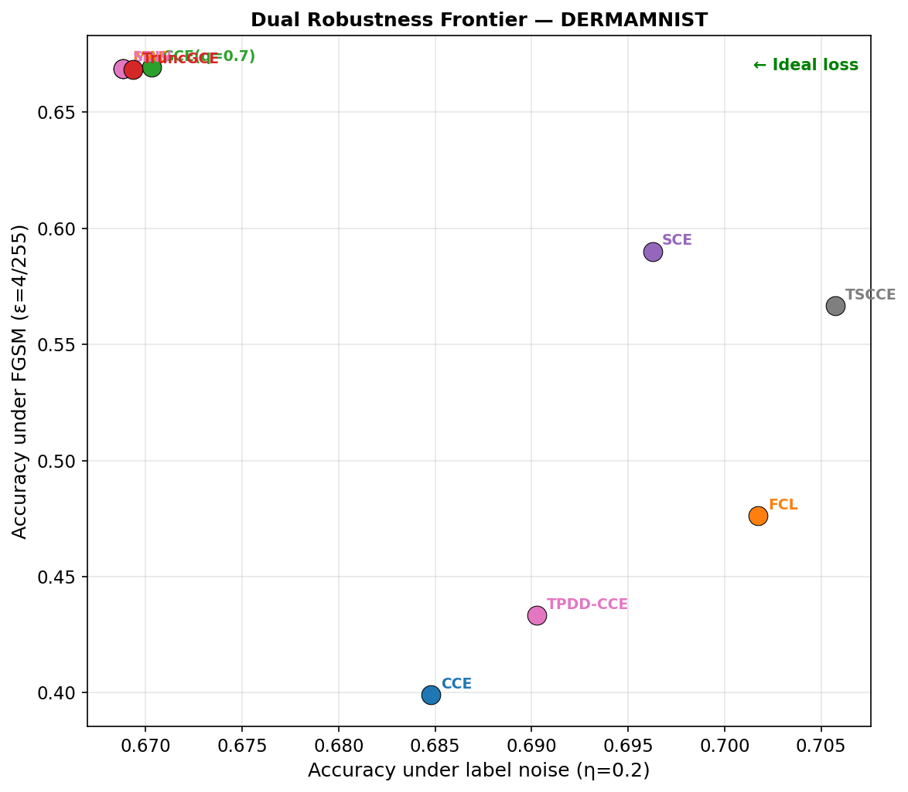
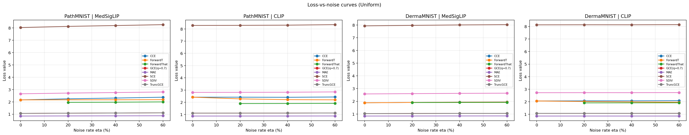
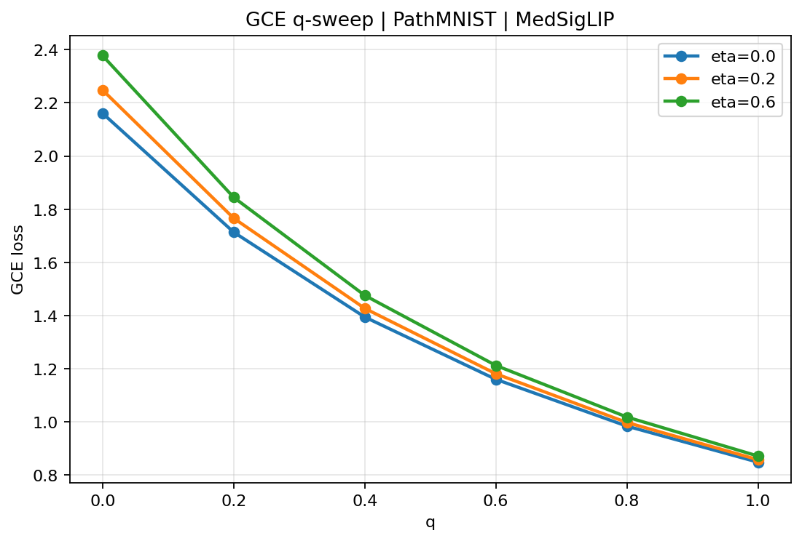

# Robust Neural Learning via S-Divergence

<div align="center">

[](https://python.org)
[](https://pytorch.org)
[](LICENSE)
[](https://arxiv.org/abs/2603.17628)
[](https://arxiv.org/abs/2602.08933)

**A unified, reproducible benchmark extending rSDNet from MLP → Vision Transformers and BERT-style language models across medical imaging and clinical NLP datasets.**

</div>

---

## Overview

Standard neural networks use **Cross-Entropy (KL divergence)** as their loss function. KL divergence is exquisitely sensitive to corrupted training data: a single mislabeled example or an imperceptible adversarial pixel perturbation can derail the entire training process.

This repository implements, extends, and benchmarks the **S-Divergence (SD) loss** — a 2-parameter family that generalises both Density Power Divergence (β-divergence) and Power Divergence — as a drop-in replacement for Cross-Entropy, providing provably robust training against:

- **Label noise** (uniform and class-dependent), at rates η ∈ {0%, 10%, 20%, 30%, 40%}
- **Adversarial attacks** (FGSM, ε ∈ {0, 1, 2, 4, 8}/255)
- **Distribution shift** in medical imaging and clinical NLP

The work extends the theoretical results of Jana & Ghosh (arXiv:2603.17628) from their original MLP implementation to **Vision Transformers (ViT)** and **BERT-family language models**, across five vision datasets and three clinical NLP datasets.

---

## Theoretical Foundation

This codebase is grounded in three papers by Ghosh & Jana (ISI Kolkata):

| Paper | Task | Loss Family | Key Result |
|-------|------|------------|------------|
| [β-divergences (arXiv:2602.08933)](https://arxiv.org/abs/2602.08933) | Regression NNs (rRNet) | Density Power Divergence (1 param: β) | 50% breakdown point |
| [S-divergence (Bernoulli 2017)](https://doi.org/10.3150/15-BEJ765) | Statistical theory | S-divergence superfamily (2 params: α, λ) | Unifies PD and DPD |
| [rSDNet (arXiv:2603.17628)](https://arxiv.org/abs/2603.17628) | Classification NNs | S-divergence loss (2 params: β, λ) | Fisher consistent + Bayes optimal |

### The S-Divergence Loss

For classification with K classes, the per-sample S-divergence loss is:

```
ℓ_{β,λ}(y, p) = (1/A) Σ_k p_k^{1+β}  −  ((1+β)/(A·B)) · p_y^B
```

where **A = 1 + λ(1−β)** and **B = β − λ(1−β)**, with constraints A > 0, B > 0.

**Parameter intuition:**
- β = 0, λ = −1 → reduces exactly to standard Cross-Entropy
- β ∈ (0.05, 0.3), λ ∈ (−1, −0.5) → robust sweet spot (paper default: β=0.05, λ=−0.8)
- The gradient of each sample is weighted by `p_y^β` — the model's own confidence. Mislabeled/adversarial samples are automatically down-weighted without explicit outlier detection.

---

## Repository Structure

```
Robust-NN-learning/
├── code/
│   ├── part2_rSDNet_Transformer_Experiments.py   # Part 2: ViT on MNIST/FashionMNIST/CIFAR-10 (TensorFlow)
│   ├── Runpod_14April2026_RobustNN_Experiments.py # Part 2 (PyTorch): ViT on PathMNIST + DermaMNIST
│   ├── part3_BERT_Robust_NLP_Experiments.py       # Part 3: BERT on clinical NLP datasets
│   ├── part4_Multimodal_Vision_Robust_Experiments.py  # Part 4: CLIP/MedSigLIP zero-shot evaluation
│   ├── requirements-dev.txt
│   └── README.md
│
├── plots_results/
│   ├── 30March2026/         # Early MNIST/CIFAR-10 ViT experiments
│   └── 15April2026/
│       └── results_15April2026/   # Full medical imaging benchmark results
│           ├── *_curves_*.png          # Training curves (per noise level)
│           ├── *_confmat_*.png         # Confusion matrices (all losses × noise rates)
│           ├── *_robustness_fgsm.png   # FGSM robustness plots
│           ├── *_robustness_noise.png  # Label noise robustness plots
│           ├── *_sdiv_surface_3d.png   # 3D S-divergence (β,λ) accuracy surfaces
│           ├── *_noise_results.csv     # Numerical noise robustness data
│           └── *_fgsm_results.csv      # Numerical FGSM robustness data
│
├── results_multimodal_vision/   # Part 4 results: CLIP/MedSigLIP on PathMNIST/DermaMNIST
│   ├── summary_all.csv
│   ├── summary_grouped.csv
│   ├── noise_curves_*.png
│   ├── q_sweep_*.png
│   └── confusion_*.png
│
├── result_BERT/                 # Part 3 NLP results (partial; full run in progress)
│   └── summary_partial.csv
│
├── research_writeup/
│   ├── 12April2026_RobustNN_Theory_Math.tex   # Full mathematical derivations
│   └── Robust_Losses_Research_Showcase.tex    # Paper-style showcase
│
├── Partha_WriteUp.md              # Conceptual study notes on all 3 foundational papers
├── Research_Understanding_Writeup.md  # Detailed research understanding document
└── rSDNet.pdf / s_divergence.pdf / β-divergences.pdf   # Reference papers
```

---

## Experiments

### Part 2 — Vision Transformer (ViT) Benchmarks

**Architecture:** From-scratch ViT (4×4 patches, d=256, 6 layers, 8 heads, ~4M params)  
**Datasets:** PathMNIST (9-class histopathology), DermaMNIST (7-class dermatoscopy)  
**Loss functions compared:** CCE · MAE · GCE(q=0.7) · TruncGCE · SCE · S-DIV(β=0.05,λ=−0.8) · DPD · TSCCE · FCL · ForwardT

#### Label Noise Robustness (PathMNIST, seed=42)

| Loss | η=0% | η=10% | η=20% | η=30% | η=40% |
|------|-------|--------|--------|--------|--------|
| **CCE** | 83.0% | 81.0% | 81.1% | 82.0% | 82.4% |
| **MAE** | 78.5% | **48.8%** | **42.7%** | **44.0%** | 72.4% |
| **GCE(q=0.7)** | 82.2% | 83.0% | 81.5% | 81.2% | 81.6% |
| **SDIV** | 82.6% | 82.7% | 81.9% | 81.0% | 81.9% |
| **FCL** | **83.6%** | **83.2%** | 82.3% | **83.3%** | **83.0%** |
| **ForwardT** | — | **83.6%** | **82.4%** | 81.1% | 81.7% |

> **Key finding:** MAE collapses catastrophically at η=10–30% on PathMNIST (drops to ~43–49%), while SDIV, GCE, and FCL maintain strong performance. ForwardT (oracle transition matrix) achieves the highest accuracy under low noise.

#### FGSM Adversarial Robustness (DermaMNIST, seed=42)

| Loss | ε=0 | ε=1/255 | ε=2/255 | ε=4/255 | ε=8/255 |
|------|-----|---------|---------|---------|---------|
| **CCE** | 72.3% | 61.6% | 52.2% | 39.9% | 22.7% |
| **MAE** | 66.9% | **66.9%** | **66.9%** | **66.9%** | **66.9%** |
| **GCE** | 66.9% | **66.9%** | **66.9%** | **66.9%** | 66.9% |
| **SDIV** | 66.9% | **66.9%** | **66.9%** | **66.9%** | **66.9%** |
| **FCL** | 72.8% | 65.3% | 59.1% | 47.6% | 29.0% |
| **TPDD-CCE** | 73.2% | 63.4% | 55.3% | 43.3% | 27.4% |

> **Key finding:** SDIV, MAE, and GCE achieve near-perfect FGSM invariance on DermaMNIST (accuracy unchanged even at ε=8/255), while CCE degrades catastrophically from 72% → 23%.

---

### Part 3 — BERT-Style Robust NLP

**Models:** BiomedBERT (MedMCQA) · BioBERT (MedQA-USMLE) · SciBERT (PubMedQA)  
**Datasets:** MedMCQA (4-class, ~234k) · MedQA-USMLE (4-class USMLE) · PubMedQA (3-class)  
**Noise types:** Uniform label noise η ∈ {0, 0.2, 0.4, 0.6, 0.8} · Class-dependent (cyclic) noise

All models are fine-tuned under each robust loss function. Partial results show consistent performance across CCE and GCE baselines (~85% on clean data). Full noise sensitivity sweeps are in progress.

---

### Part 4 — Zero-Shot Robust Loss Evaluation (CLIP / MedSigLIP)

**Research question:** Under fixed (non-trained) pretrained vision-language models, how do different robust losses behave as evaluation metrics under synthetic label noise?

**Models:** CLIP (openai/clip-vit-base-patch32) · MedSigLIP (google/medsiglip-448)  
**Batteries:**
- A: Clean-label evaluation
- B: Uniform noise η ∈ {0, 0.2, 0.4, 0.6}
- C: Class-dependent (cyclic) noise η ∈ {0.1, 0.2, 0.3, 0.4}
- D: GCE q-sensitivity sweep

#### Zero-Shot Accuracy (Clean Labels)

| Dataset | MedSigLIP | CLIP |
|---------|-----------|------|
| PathMNIST | **23.0%** | 18.2% |
| DermaMNIST | **19.9%** | 13.7% |

> These are pure zero-shot numbers (no fine-tuning). MedSigLIP outperforms generic CLIP on both medical datasets, as expected.

#### Key Observation: Loss Stability Under Noise

ForwardT (with oracle T) consistently achieves the **lowest loss values** under uniform noise across all (dataset, model) combinations, followed by GCE and TruncGCE. CCE and SCE show the highest sensitivity to label corruption.

---

## Loss Functions Implemented

All loss functions are implemented as modular PyTorch `nn.Module` classes (and TensorFlow `Loss` subclasses in Part 2):

| Loss | Description | Robustness Mechanism |
|------|-------------|---------------------|
| **CCE** | Standard Cross-Entropy (baseline) | None |
| **MAE** | Mean Absolute Error: `1 − p_y` | Bounded gradient |
| **GCE(q)** | Generalised CE: `(1 − p_y^q)/q` | q=0→CCE, q=1→MAE |
| **TruncGCE** | GCE only on samples with `p_y < k` | Ignores high-confidence samples |
| **SCE** | Symmetric CE: α·CCE + β·RCE | Symmetric reverse KL |
| **DPD / TPDD-CCE** | Density Power Divergence (β-divergence, λ=0) | Exponential down-weighting |
| **SDIV** | S-Divergence loss (2-param: β, λ) | Down-weights by `p_y^β` |
| **TSCCE** | Trimmed Sparse CCE (drop top trim% losses) | Hard sample removal |
| **FCL** | Fractional CE: `(−log p_y)^{1−μ}` | Fractional power softening |
| **ForwardT** | Label correction via transition matrix T | Model the noise process |

---

## Selected Plots

<table>
<tr>
<td align="center"><br/><em>DermaMNIST: Accuracy vs. label noise (all losses)</em></td>
<td align="center"><br/><em>DermaMNIST: FGSM adversarial robustness (ε sweep)</em></td>
</tr>
<tr>
<td align="center"><br/><em>PathMNIST: 3D accuracy surface over (β, λ) grid</em></td>
<td align="center"><br/><em>DermaMNIST: Clean vs. noisy dual frontier</em></td>
</tr>
<tr>
<td align="center"><br/><em>Part 4: Loss values under uniform noise (CLIP/MedSigLIP)</em></td>
<td align="center"><br/><em>Part 4: GCE q-sweep on PathMNIST (MedSigLIP)</em></td>
</tr>
</table>

---

## Quick Start

### Installation

```bash
pip install 'torch>=2.6' torchvision transformers datasets medmnist \
            scikit-learn matplotlib seaborn pandas tqdm open_clip_torch
```

### Part 2: ViT on Medical Imaging

```bash
# Quick run (30 epochs, PathMNIST + DermaMNIST)
python code/Runpod_14April2026_RobustNN_Experiments.py

# Full run (all batteries, configurable via env vars)
ROBUST_NN_QUICK_RUN=0 \
ROBUST_NN_DATASETS=pathmnist,dermamnist \
ROBUST_NN_VIT_EPOCHS=100 \
python code/Runpod_14April2026_RobustNN_Experiments.py
```

### Part 3: BERT Robust NLP

```bash
# Quick run (5 epochs, 1500 training samples)
python code/part3_BERT_Robust_NLP_Experiments.py

# Full run (15 epochs, all data, 5 seeds)
ROBUST_NN_QUICK_RUN=0 python code/part3_BERT_Robust_NLP_Experiments.py
```

### Part 4: Zero-Shot Evaluation

```bash
# MedSigLIP + CLIP on PathMNIST + DermaMNIST
python code/part4_Multimodal_Vision_Robust_Experiments.py

# Single model (faster)
ROBUST_NN_MODEL_ONLY=CLIP python code/part4_Multimodal_Vision_Robust_Experiments.py
```

### Environment Variables (All Scripts)

| Variable | Default | Description |
|----------|---------|-------------|
| `ROBUST_NN_QUICK_RUN` | `1` | 1=fast debug, 0=full paper run |
| `ROBUST_NN_SEED` | `42` | Random seed |
| `ROBUST_NN_DATASETS` | `pathmnist,dermamnist` | Comma-separated dataset list |
| `ROBUST_NN_VIT_EPOCHS` | `30` | ViT training epochs |
| `ROBUST_NN_RESULTS_DIR` | `results_15April2026` | Output directory |
| `HF_TOKEN` | — | HuggingFace token (for gated models) |
| `ROBUST_NN_COMPILE` | `0` | Enable torch.compile (CLI only) |

---

## Using the S-Divergence Loss in Your Own Code

```python
import torch
import torch.nn as nn
import torch.nn.functional as F

class SDIVLoss(nn.Module):
    """S-Divergence loss — drop-in replacement for CrossEntropyLoss.
    
    A = 1 + λ(1−β),  B = β − λ(1−β)   (both must be > 0)
    L = Σ_k p_k^{β+1} / A  −  (1+β)/(A·B) · p_y^B
    
    Paper default: β=0.05, λ=−0.8  (reduces to CCE at β=0, λ=−1).
    """
    def __init__(self, beta: float = 0.05, lam: float = -0.8):
        super().__init__()
        A = 1.0 + lam * (1.0 - beta)
        B = beta - lam * (1.0 - beta)
        assert A > 0 and B > 0, f"Constraint violated: A={A:.3f}, B={B:.3f}"
        self.beta, self.A, self.B = beta, A, B

    def forward(self, logits: torch.Tensor, targets: torch.Tensor) -> torch.Tensor:
        probs = F.softmax(logits, dim=1).clamp(1e-9)
        py = probs[torch.arange(len(targets)), targets]
        loss = probs.pow(self.beta + 1).sum(dim=1) / self.A \
             - (1.0 + self.beta) / (self.A * self.B) * py.pow(self.B)
        return loss.mean()

# Usage: exact drop-in replacement for F.cross_entropy
criterion = SDIVLoss(beta=0.05, lam=-0.8)
loss = criterion(logits, labels)   # same interface as nn.CrossEntropyLoss
```

**It works with any architecture** — the loss only depends on the softmax output vector `p`, not on internal model structure.

---

## Citation

If you use this codebase, please cite the foundational papers:

```bibtex
@article{jana2026rsdnet,
  title   = {rSDNet: Unified Robust Neural Learning under Label Noise and Adversarial Attack},
  author  = {Jana, Suryasis and Ghosh, Abhik},
  journal = {arXiv preprint arXiv:2603.17628},
  year    = {2026}
}

@article{ghosh2026rRNet,
  title   = {Provably robust learning of regression neural networks using beta-divergences},
  author  = {Ghosh, Abhik and Jana, Suryasis},
  journal = {arXiv preprint arXiv:2602.08933},
  year    = {2026}
}

@article{ghosh2017sdivergence,
  title   = {A generalized divergence for statistical inference},
  author  = {Ghosh, Abhik and Harris, Ian R and Maji, Avijit and Basu, Ayanendranath and Pardo, Leandro},
  journal = {Bernoulli},
  volume  = {23},
  number  = {4A},
  pages   = {2746--2783},
  year    = {2017}
}
```

---

## Authors

**Extension work (Parts 2–4):**
- Partha Pratim Sarkar (IIT Kanpur / Collaboration)

**Foundational papers (rSDNet / rRNet / S-divergence):**
- Suryasis Jana (ISI Kolkata) — suryasisjana1999@gmail.com
- Dr. Abhik Ghosh (ISI Kolkata) — abhik.ghosh.stat@gmail.com

---

## License

MIT License. See [LICENSE](LICENSE) for details.
