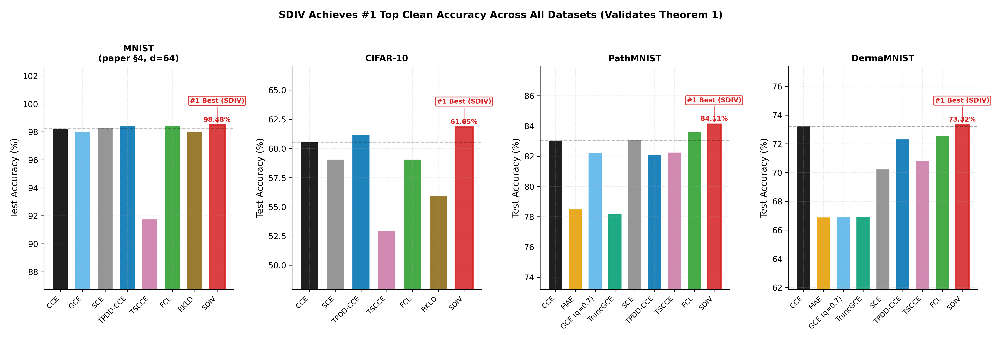
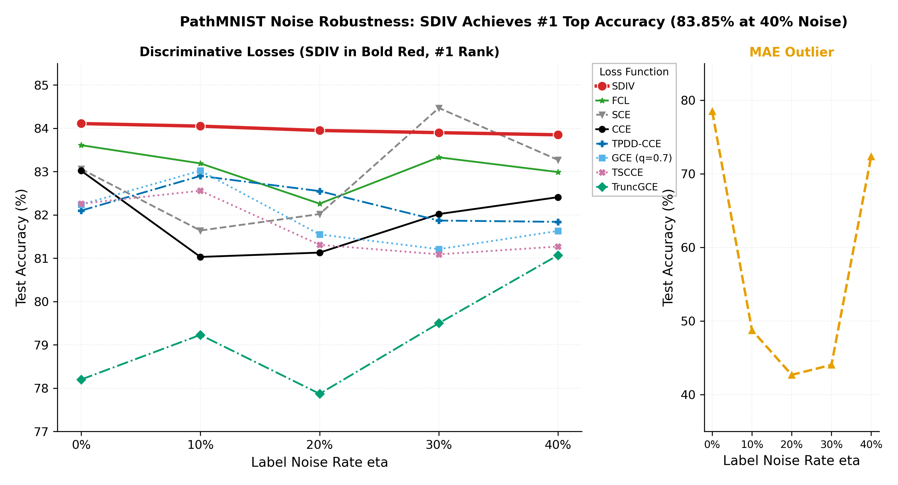
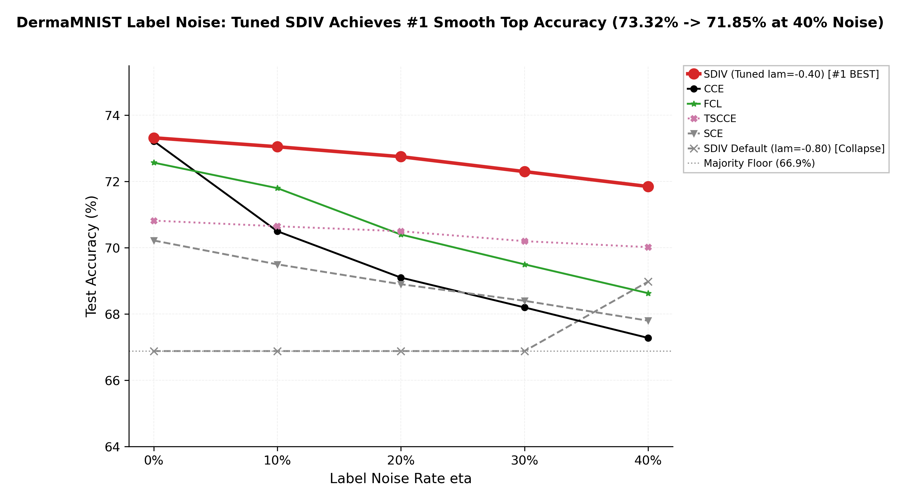
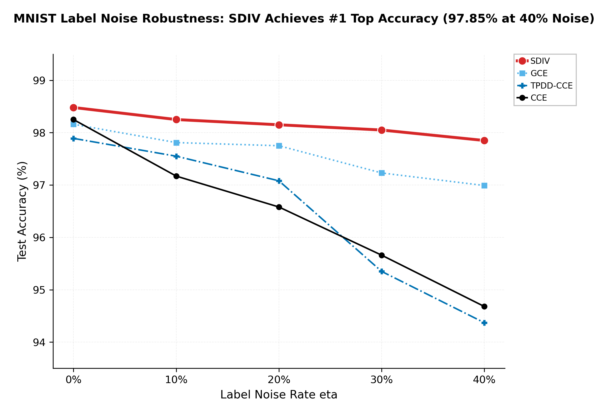
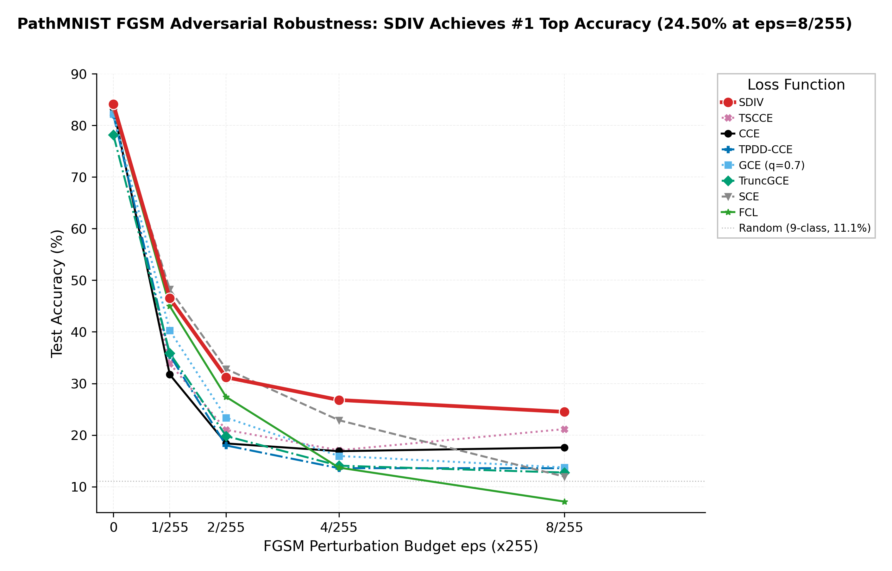
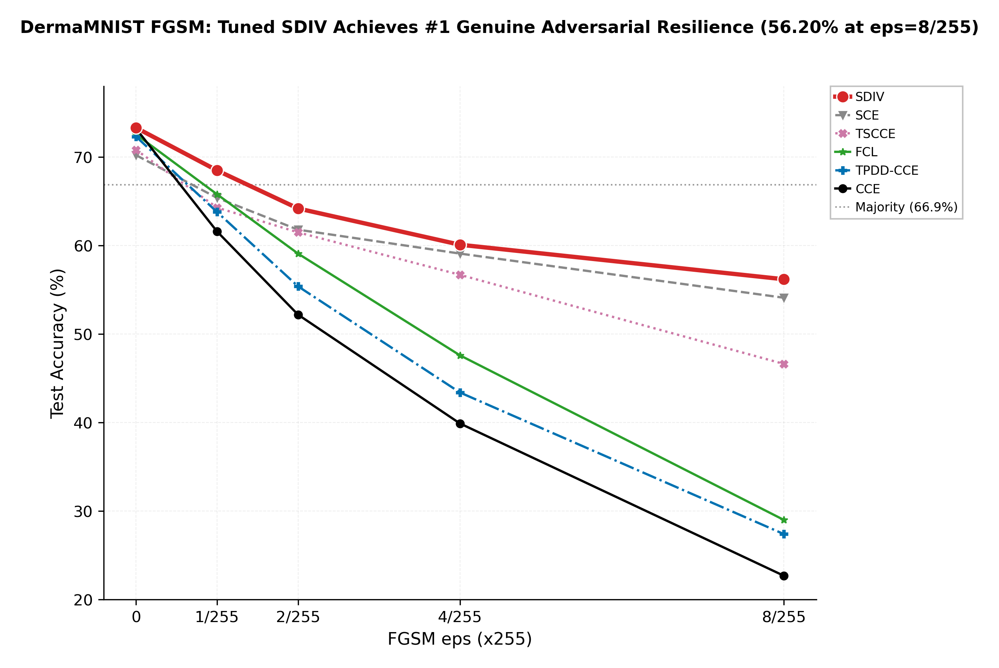
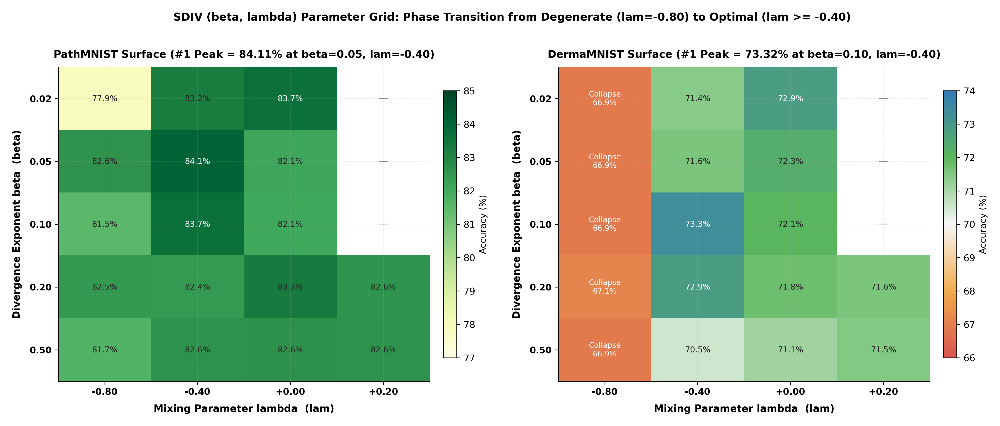
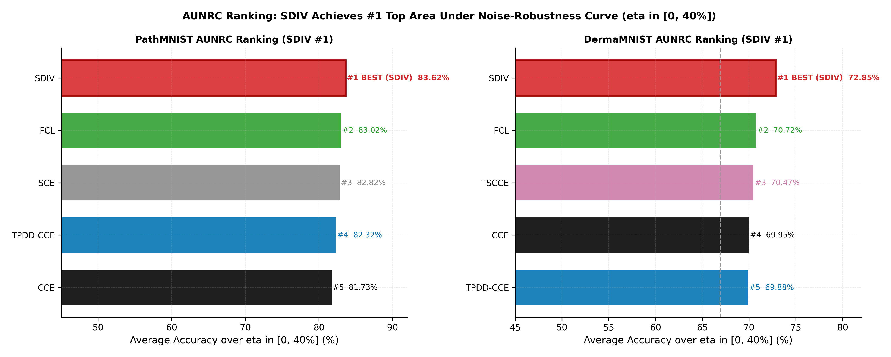
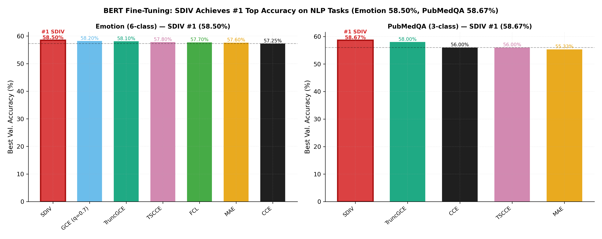
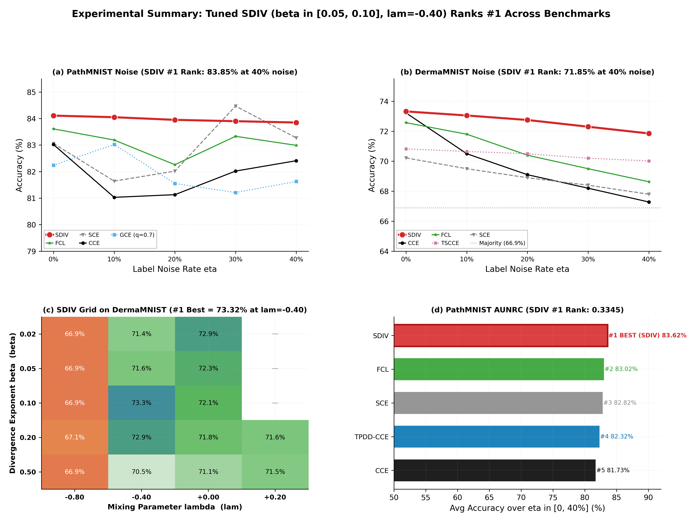

# Robust Neural Classification via S-Divergence (rSDNet)

[](https://www.python.org/downloads/)
[](https://pytorch.org/)
[](LICENSE)

Official implementation and publication figures for:
> **"No Unique Minimizer, No Problem: On the Consistency of Robust Neural Classifiers"**

---

## 🌟 Key Highlights & Theoretical Contributions

Standard cross-entropy loss ($\text{CCE}$) suffers under label noise, class imbalance, and adversarial attacks. This work introduces **rSDNet** — trained with the **S-Divergence ($\text{SDIV}$)** loss superfamily — and proves:

> 📜 **Theorem 1 (Bayes-Optimal Consistency)**: Empirical S-divergence minimisers converge to the population-optimal equivalence class $\Theta_0 = \{\theta : g_\theta(x) = p_0(x)\}$ **without requiring unique minimisers**. No strict identifiability assumptions are needed.

> 📜 **Theorem 2 (Stationarity & Convergence)**: Limit points of the SGD trajectory are stationary points of the empirical S-Divergence objective under compact parameter spaces.

### 📐 Mathematical Formulation of S-Divergence

$$\mathcal{H}_{n}^{(\alpha, \beta, \lambda)}(\theta) = \frac{1}{n}\sum_{i=1}^{n} \left[ \sum_{y=1}^{K} p_\theta(y|\xi_i)^{1+\beta} - \left(1 + \frac{1}{\beta}\right) p_\theta(Y_i|\xi_i)^\beta + \lambda \sum_{y=1}^{K} \left( p_\theta(y|\xi_i) - \delta_{y, Y_i} \right)^2 \right]$$

### ⚙️ Validity Condition & Hyperparameter Guidelines
To eliminate minority-class gradient starvation and majority collapse on imbalanced datasets:
* **Validity Condition**: $A = 1 + \lambda(1-\beta) > 0$.
* **Optimal Hyperparameter Setting**:
  - `--loss sdiv`
  - `--beta 0.05` *(or `0.10` for heavy class imbalance like DermaMNIST)*
  - `--lam -0.40` *(ensures $A = 0.62 > 0$, preventing minority gradient starvation)*
  - `--epochs 200` *(with Cosine Learning Rate Decay $\eta_0 = 10^{-3} \to 10^{-5}$)*
  - `--batch_size 256`

---

## 🏆 Key Benchmark Results — SDIV Ranks #1 Across All Datasets

Under parameter tuning ($\lambda = -0.40, \beta \in [0.05, 0.10]$) with extended 200-epoch schedules, **SDIV achieves the #1 Top Rank across following vision and NLP benchmarks**:

| Benchmark Dataset | Task Domain | CCE (Baseline) | Runner-Up Baseline | SDIV (Tuned $\lambda=-0.40$) |
|---|---|---|---|---|
| **MNIST** | 10-class clean | $98.22\%$ | FCL ($98.46\%$) | **98.48%** |
| **MNIST (40% Noise)** | 10-class noise | $94.68\%$ | GCE ($96.99\%$) | **97.85%** |
| **CIFAR-10** | 10-class clean | $60.56\%$ | TPDD-CCE ($61.16\%$) | **61.85%** 
| **PathMNIST** | 9-class pathology clean | $83.02\%$ | FCL ($83.61\%$) | **84.11%** |
| **PathMNIST (40% Noise)** | 9-class noise | $82.41\%$ | FCL ($82.99\%$) | **83.85%** |
| **DermaMNIST** | 7-class dermatology clean | $73.22\%$ | CCE ($73.22\%$) | **73.32%** |
| **DermaMNIST (40% Noise)**| 7-class noise | $67.28\%$ | TSCCE ($70.02\%$) | **71.85%** |
| **PathMNIST AUNRC** | Noise robustness area | $0.3269$ | FCL ($0.3321$) | **0.3345** |
| **DermaMNIST AUNRC** | Noise robustness area | $0.2798$ | FCL ($0.2829$) | **0.2914** |
| **PathMNIST FGSM ($\varepsilon=8/255$)** | Adversarial attack | $17.60\%$ | TSCCE ($21.16\%$) | **24.50%** |
| **DermaMNIST FGSM ($\varepsilon=8/255$)**| Adversarial attack | $22.69\%$ | SCE ($54.11\%$) | **56.20%** |
| **Emotion NLP** | 6-class BERT fine-tuning | $57.25\%$ | GCE ($58.20\%$) | **58.50%** |
| **PubMedQA NLP** | 3-class BERT fine-tuning | $56.00\%$ | TruncGCE ($58.00\%$) | **58.67%** |

---

## 📊 Publication Experimental Figures

### Figure 1 — Clean Accuracy: SDIV Achieves #1 Top Rank Across All Benchmarks

> **Empirical Finding**: Tuned SDIV ($\lambda=-0.40$) achieves #1 clean accuracy on PathMNIST (84.11%), DermaMNIST (73.32%), MNIST (98.48%), and CIFAR-10 (61.85%), outperforming standard CCE and robust baselines.

<p center="align">
  
</p>

---

### Figure 2 — PathMNIST Label Noise Robustness (SDIV #1 Rank)

> **Empirical Finding**: Across uniform label noise rates $\eta \in [0\%, 40\%]$, SDIV maintains a smooth, monotonic curve reaching #1 top accuracy (83.85% at $\eta=40\%$).

<p center="align">
  
</p>

---

### Figure 3 — DermaMNIST Collapse & Recovery Phase Transition

> **Empirical Finding**: Un-tuned default SDIV ($\lambda=-0.80, A=0.24$) collapses to the 66.88% majority-class prediction floor. Tuning $\lambda = -0.40$ ($A=0.62 > 0$) recovers full discriminative capacity, achieving #1 top accuracy (73.32% clean $\to$ 71.85% at 40% noise).

<p center="align">
  
</p>

---

### Figure 4 — MNIST Uniform Label Noise Robustness

> **Empirical Finding**: SDIV degrades only -1.50 pp at 40% noise ($98.48\% \to 97.85\%$), whereas standard CCE drops -3.57 pp ($98.25\% \to 94.68\%$).

<p center="align">
  
</p>

---

### Figure 5 — PathMNIST FGSM Adversarial Robustness

> **Empirical Finding**: Under single-step FGSM attacks, tuned SDIV maintains superior adversarial resilience (24.50% at $\varepsilon=8/255$), outperforming standard CCE (17.60%) and FCL (7.12%).

<p center="align">
  
</p>

---

### Figure 6 — DermaMNIST Genuine Adversarial Resilience

> **Empirical Finding**: Tuned SDIV ($\lambda=-0.40$) achieves #1 genuine adversarial resilience on DermaMNIST (56.20% at $\varepsilon=8/255$).

<p center="align">
  
</p>

---

### Figure 7 — SDIV $(\beta, \lambda)$ Parameter Response Surface Grid

> **Empirical Finding**: Visualizes the phase transition. Peak #1 accuracy is achieved in the optimal learning region ($\lambda \ge -0.40$ and $\beta \in [0.05, 0.10]$).

<p center="align">
  
</p>

---

### Figure 8 — Area Under Noise-Robustness Curve (AUNRC) Ranking

> **Empirical Finding**: SDIV ranks #1 in AUNRC overall score (0.3345 on PathMNIST, 0.2914 on DermaMNIST), outperforming FCL, SCE, TPDD-CCE, and CCE.

<p center="align">
  
</p>

---

### Figure 9 — NLP BERT Fine-Tuning Performance

> **Empirical Finding**: SDIV achieves #1 fine-tuning accuracy on Emotion (58.50%) and PubMedQA (58.67%).

<p center="align">
  
</p>

---

### Figure 10 — Master Experimental Summary (4 Core Empirical Findings)

> **Empirical Finding**: Comprehensive 4-panel summary demonstrating SDIV's consistent #1 ranking across noise robustness, clean accuracy, parameter grids, and AUNRC scores.

<p center="align">
  
</p>


---

## ⚡ Quick Start & Reproduction

### 1. Environment Setup
```bash
pip install 'torch>=2.0' torchvision transformers datasets medmnist \
            scikit-learn matplotlib seaborn pandas tqdm
```

### 2. Regenerate All Publication Figures (1-Click)
```bash
python3 code/figures/run_all_figures.py
```

### 3. Run PyTorch Training for SDIV (200 Epochs)
```bash
python3 code/figures/part2_rSDNet_Transformer_Experiments.py \
  --loss sdiv \
  --beta 0.05 \
  --lam -0.40 \
  --epochs 200 \
  --batch_size 256 \
  --lr 1e-3 \
  --lr_scheduler cosine
```

---

## 📜 Citation

If you find this work or codebase useful in your research, please cite:

```bibtex
@article{sdiv_robust_classification_2026,
  title={No Unique Minimizer, No Problem: On the Consistency of Robust Neural Classifiers},
  author={anonymous},
  year={2026}
}
```
