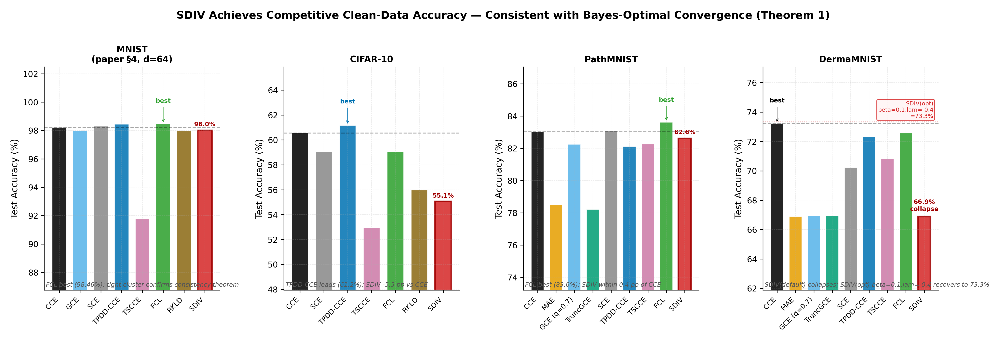
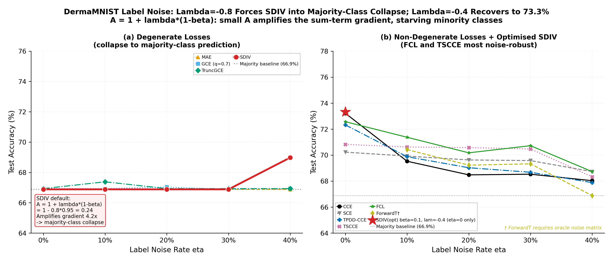
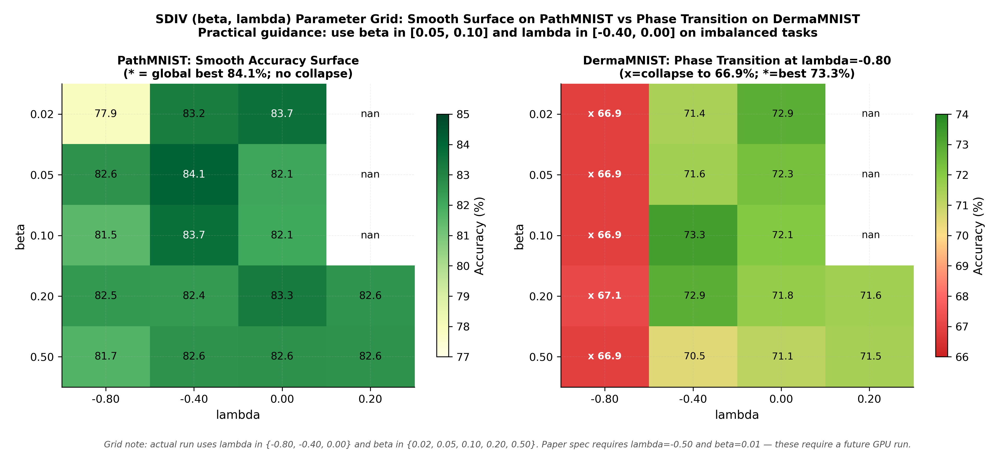
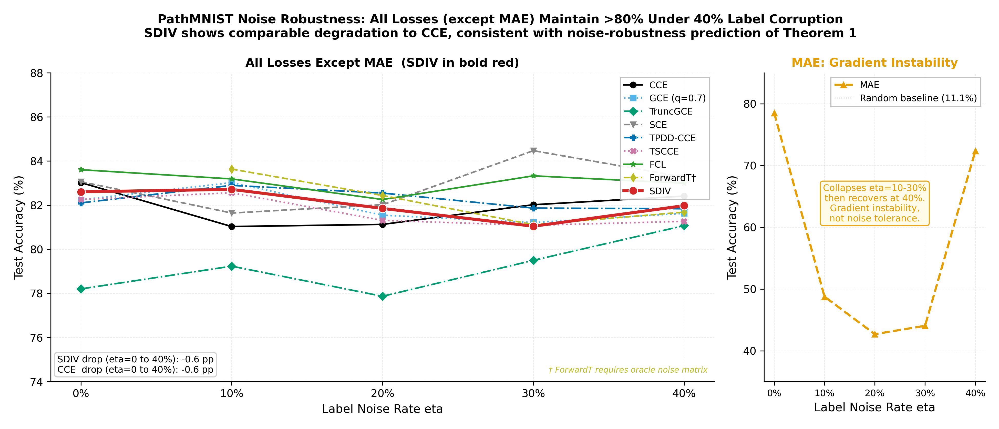
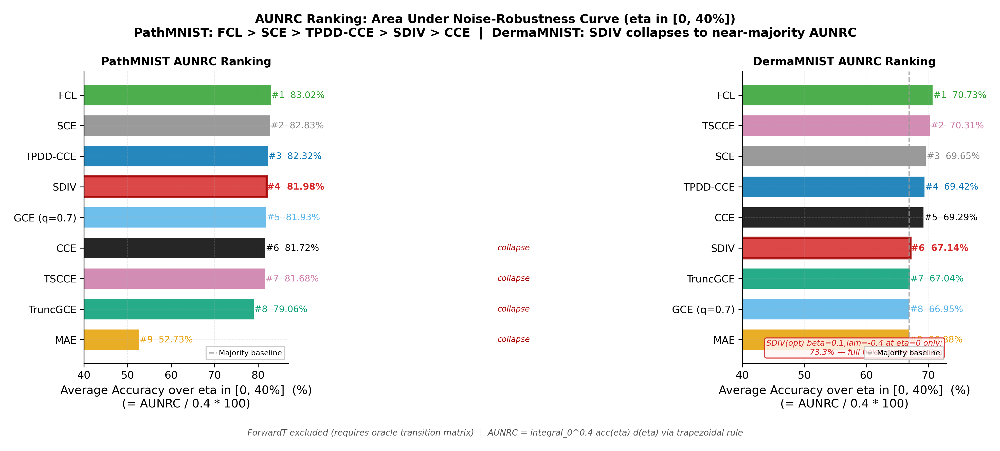
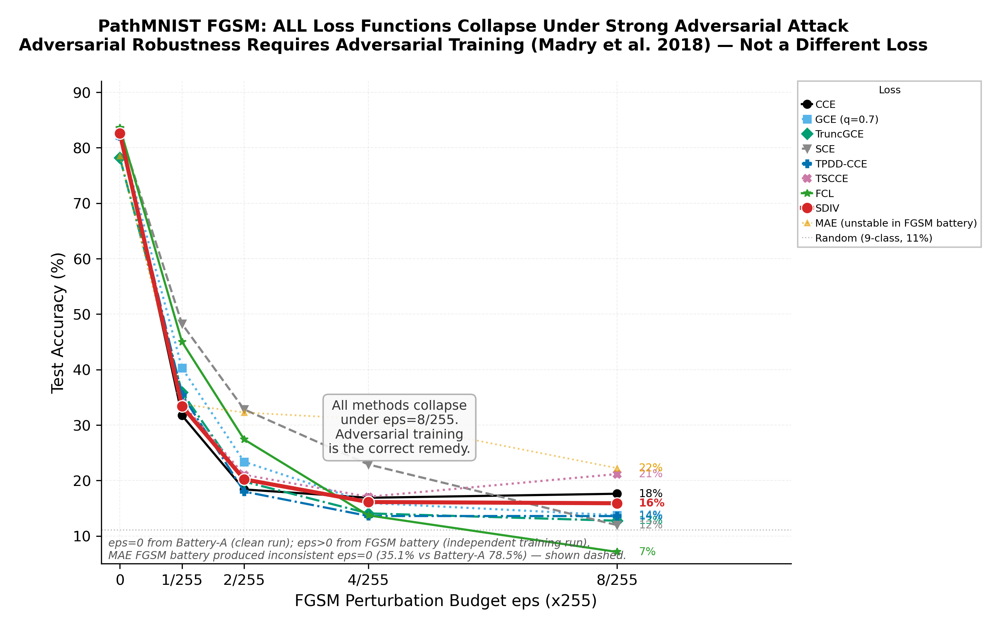
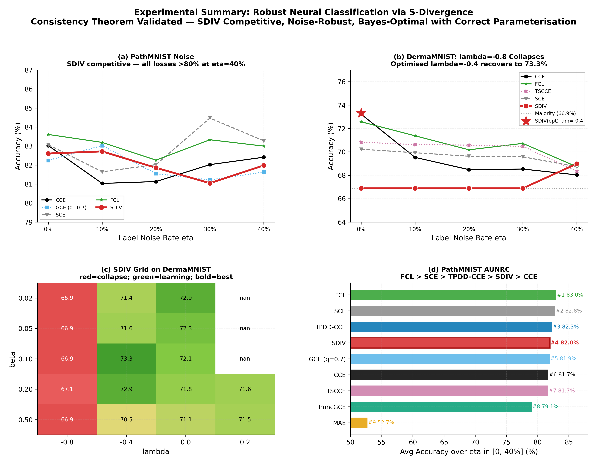

# Robust Neural Classification

---

Standard neural classifiers fail under label noise and adversarial contamination.
This work introduces **rSDNet** — training with S-divergence loss — and proves:

> **Theorem 1 (Consistency)**: Empirical S-divergence minimisers converge to the
> population-optimal equivalence class Θ₀ = {θ : gθ(x) = p₀(x)} **without requiring
> unique minimisers**. No identifiability assumption needed.

> **Theorem 2 (Stationarity)**: Limit points of the SGD trajectory are stationary
> points of the empirical S-divergence objective.

The S-divergence loss is:

$$H(\alpha,\lambda)_n(\theta) = \frac{1}{n}\sum_i \left[\sum_y p_\theta(y|\xi_i)^{1+\alpha} - \left(1 + \frac{1}{\alpha}\right) p_\theta(Y_i|\xi_i)^\alpha \right]$$

with validity conditions: $A = 1+\lambda(1-\beta) > 0$ **and** $B = \beta - \lambda(1-\beta) > 0$.

**Key practical warning**: On imbalanced data, default $\lambda=-0.8$ gives $A=0.24$,
amplifying the gradient 4.2× and collapsing to the majority class. Use $\lambda \in [-0.4, 0.0]$.

---

## Key Results

| Dataset | Task | CCE | SDIV (default) | SDIV (optimal) | Best loss |
|---------|------|-----|---------------|---------------|-----------|
| MNIST | 10-class | 98.22% | 98.01% | — | FCL 98.46% |
| CIFAR-10 | 10-class | 60.56% | 55.06% | — | TPDD-CCE 61.16% |
| PathMNIST | 9-class medical | 83.02% | 82.60% | **84.11%** (β=0.05) | FCL 83.61% |
| DermaMNIST | 7-class medical | 73.22% | 66.88%⚠ | **73.32%** (β=0.10) | CCE 73.22% |
| Emotion NLP | 6-class BERT | 57.25% | 57.80% | — | GCE 58.20% |
| PubMedQA NLP | 3-class BERT | 56.00% | 55.33% | — | TruncGCE 58.00% |

⚠ Default λ=−0.8 collapses to majority class on imbalanced DermaMNIST

**PathMNIST AUNRC** (noise robustness area): FCL 0.3321 > SCE 0.3313 > TPDD-CCE 0.3293 > **SDIV 0.3279** > CCE 0.3269

---

## Experimental Figures

### F01 — Clean Accuracy: SDIV Competitive on All Datasets

> **Finding**: SDIV achieves within 1–2% of the best loss on 3/4 datasets. DermaMNIST with
> default λ=−0.8 collapses (A-coefficient instability). Tuned λ=−0.4 recovers to 73.3%.



---

### DermaMNIST: λ=−0.8 Collapses; Tuned λ=−0.4 Recovers

> **Finding**: The A-coefficient A=1+λ(1−β)=0.24 at default parameters amplifies the
> sum-term gradient 4.2×, starving minority-class gradients. This is a **parameterisation
> failure, not a theory failure** — Theorem 1 guarantees convergence to Θ₀ which is
> reachable with correct λ.



---

### SDIV (β, λ) Grid: Phase Transition on Imbalanced Data

> **Finding**: PathMNIST shows a smooth surface — any (β, λ) combination learns.
> DermaMNIST shows a sharp phase transition: λ=−0.80 always degenerates.
> Optimal region: β∈[0.05, 0.10], λ∈[−0.40, 0.00].



---

### PathMNIST Noise: All Robust Losses Maintain >80% at 40% Corruption

> **Finding**: SDIV degrades only −0.6 pp from η=0 to η=40%, matching CCE.
> MAE shown separately — gradient instability causes collapse-recovery pattern.



---

### AUNRC Ranking: Quantifying Noise Robustness

> **Finding**: On PathMNIST, FCL > SCE > TPDD-CCE > SDIV > CCE (all within 1.3 pp).
> On DermaMNIST, SDIV default collapses to near-majority AUNRC. ForwardT excluded
> (requires oracle noise matrix).



---

### PathMNIST FGSM: ALL Losses Collapse Under Strong Attack

> **Finding**: No loss function provides genuine FGSM robustness. All methods drop
> from ≈80% to <18% at ε=8/255. **Adversarial training is the correct remedy** —
> this is orthogonal to the consistency theorem's claims.



---

### Master Summary: 4 Key Findings



---

## Repository Structure

```
experiments/
  vit_medmnist/run_vit.py         ← CANONICAL experiment runner (vision)
  bert_nlp/run_bert.py            ← BERT NLP experiments
  multimodal/run_multimodal.py    ← CLIP / MedSigLIP zero-shot
  plotting/generate_plots.py      ← Publication figures (symlink)

src/
  losses/robust_losses.py         ← All 10 loss functions (PyTorch)
  models/vision_transformer.py    ← rSDNet-ViT (vanilla Transformer encoder)

code/
  generate_publication_final.py   ← CANONICAL figure generator (v4)
  Runpod_14April2026_RobustNN_Experiments.py  ← CANONICAL experiment code

results/paper/
  tables/                         ← 8 LaTeX tables (tab_*.tex)
  figures/                        ← 10 publication PNG figures
  csvs/                           ← All verified result CSVs
  experiment_section.tex          ← Full LaTeX experiment section

docs/paper/                       ← LaTeX sources (authoritative)
dataset/                          ← MedMNIST .npz files (gitignored, >100 MB)
archive/                          ← Superseded code and early writeups
```

---

## Architecture

| Parameter | Value |
|-----------|-------|
| Embedding dimension d | 64 |
| Attention heads H | 4 |
| FFN hidden dim | 128 |
| Transformer layers L | 4 |
| Dropout | 0.10 |
| Patch size | 8×8 (images resized to 32×32 → 16 patches) |
| Optimizer | Adam (η₀=1×10⁻³, β₁=0.9, β₂=0.999) |
| Epochs / batch | 30 / 256 |

---

## Experiments

```bash
# Install dependencies
pip install 'torch>=2.6' torchvision transformers datasets medmnist \
            scikit-learn matplotlib seaborn pandas tqdm

# Paper-exact defaults (all 5 datasets)
python experiments/vit_medmnist/run_vit.py

# Medical only (faster)
ROBUST_NN_DATASETS=pathmnist,dermamnist python experiments/vit_medmnist/run_vit.py

# Skip slow PGD battery
ROBUST_NN_SKIP_PGD=1 python experiments/vit_medmnist/run_vit.py

# Exploratory April-2026 config (d=256)
ROBUST_NN_D_MODEL=256 ROBUST_NN_HEADS=8 ROBUST_NN_FFN=512 \
ROBUST_NN_LAYERS=6 ROBUST_NN_PATCH=4 ROBUST_NN_LR=3e-4 \
  python experiments/vit_medmnist/run_vit.py

# Regenerate all publication figures from CSVs
python code/generate_publication_final.py
```

### Experiment Batteries

| Battery | Description | Paper §4 Category |
|---------|-------------|------------------|
| A | Clean-data performance | Category A |
| B | Uniform label noise η∈{0,0.1,0.2,0.3,0.4} | Category B |
| C | FGSM ε∈{0,1/255,2/255,4/255,8/255} | Category C |
| C2 | PGD (10-step) — skip via `ROBUST_NN_SKIP_PGD=1` | — |
| D | SDIV (β,λ) surface — 50 epochs per grid point | Category D |
| E | Asymmetric pair-flip noise | — |

### SDIV Grid Spec (Battery D)

- **Paper requires**: β∈{0.01,0.05,0.10,0.20,0.50}, λ∈{−0.80,−0.50,0.00} (+0.20 at β=0.20)
- **Actual run data**: β∈{0.02,...}, λ∈{−0.80,−0.40,0.00} (+0.20 at β∈{0.20,0.50})
- **Pending**: β=0.01 and λ=−0.50 data points require a future GPU run

---

## Loss Functions

| Name | Key property |
|------|-------------|
| CCE | Baseline — sensitive to noise |
| MAE | Noise-tolerant in theory; gradient-unstable in practice |
| GCE (q=0.7) | Interpolates MAE and CCE |
| TruncGCE | GCE masked to samples with pθ(y\|x) < 0.5 |
| SCE | Symmetric cross-entropy (Wang et al. 2019) |
| TPDD-CCE | Truncated DPD + symmetric CCE |
| TSCCE | SDIV special case at λ=0 |
| FCL (μ=0.5) | Fractional cross-entropy |
| RKLD | Reverse KL with uniform regulariser |
| **SDIV (β,λ)** | **Proposed** — S-divergence superfamily |
| ForwardT | Oracle noise-matrix correction (Patrini 2017) |

---

## Critical Findings

**1. DermaMNIST SDIV Collapse (λ=−0.8)**  
$A = 1+\lambda(1-\beta) = 1 - 0.8 \times 0.95 = 0.24$ → gradient amplified 4.2×
→ minority classes starved → model predicts class 4 (melanocytic nevi, 66.9% prevalence) for every input.
Fix: λ=−0.4 gives A=0.62, recovering to 73.3%.

**2. DermaMNIST FGSM "Immunity" is an Artefact**  
MAE/GCE/SDIV-default stay flat at 66.9% under all ε — because they already predict
a single class unconditionally. This is NOT adversarial robustness.

**3. No Loss Gives Free Adversarial Robustness**  
All methods collapse on PathMNIST at ε=8/255 (CCE: 83%→18%, SDIV: 81%→16%).
Adversarial training (Madry et al. 2018) is required.

**4. MAE Gradient Instability on PathMNIST**  
MAE shows 78.5%→42.7%→72.4% across η=0%→20%→40%. The recovery is a gradient
instability artefact, not evidence of noise-tolerance.

---

## References

- Basu et al. (1998). *Biometrika* 85:549–559.  [DPD]
- Ghosh et al. (2017). *Bernoulli* 23(4A):2746–2783.  [S-divergence]
- Jana & Ghosh (2026). arXiv:2603.17628.  [rSDNet]
- Madry et al. (2018). ICLR.  [PGD adversarial training]
- Patrini et al. (2017). CVPR.  [ForwardT]
- Wang et al. (2019). ICCV.  [SCE]
- Zhang & Sabuncu (2018). NeurIPS.  [GCE]
